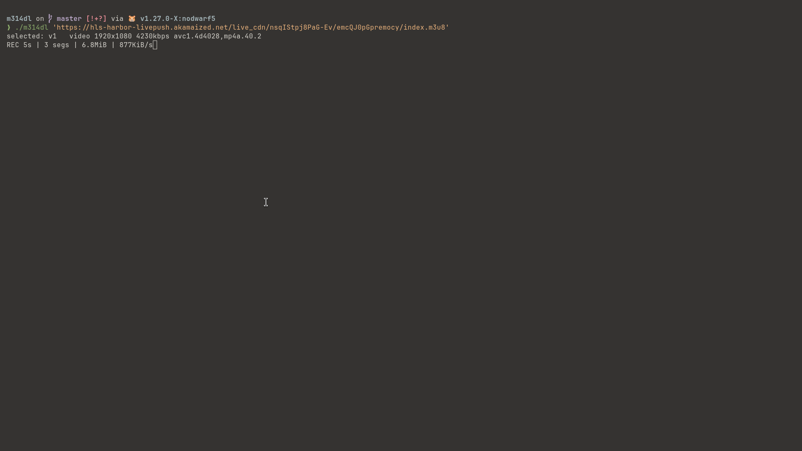

# m314dl — a fast, all-in-one video stream downloader

**m314dl** downloads streaming video to a normal `.mp4` file on your computer.
It handles the two formats almost every streaming site uses — **HLS**
(`.m3u8`) and **DASH** (`.mpd`) — and, when you have the key, it can **unlock
DRM-protected video by itself**, with no extra tools to install.

It's a single small program. No runtime, no plugins, no `mp4decrypt` or
`shaka-packager` on the side. You give it a link, it gives you a video file.



```sh
m314dl -o movie.mp4 https://example.com/master.m3u8
```

## Why I built it

For about a year my go-to tool was
[N_m3u8DL-RE](https://github.com/nilaoda/N_m3u8DL-RE) — it's excellent, and it's
the reason I got deep enough into this to build my own. Huge shout-out to it. 🙏

I started m314dl because the tools I tried never covered *all* of what I
needed at once: downloading and decrypting in a single pass, running as a
server, and re-broadcasting a live stream. So I wrote one that does. If your
needs are simpler, N_m3u8DL-RE is still a great choice — m314dl is what you
reach for when you want everything in one binary.

## Install

**Option 1 — Docker (nothing else to install):**

```sh
docker build -t m314dl .
docker run --rm -v "$PWD:/data" m314dl -o movie.mp4 https://example.com/master.m3u8
```

The image already includes `ffmpeg`. Your download appears in the current
folder (that's what `-v "$PWD:/data"` does).

**Option 2 — build it yourself:**

```sh
go build -o m314dl .
```

You'll also need `ffmpeg` installed (it's used to combine video and audio into
the final file).

## How to use it

```sh
# Download a stream — best video + best audio + subtitles, into movie.mp4
m314dl -o movie.mp4 https://example.com/master.m3u8

# Download and unlock a DRM stream in one step (you provide the key)
m314dl -key KID:KEY -o movie.mp4 https://example.com/manifest.mpd

# See what video/audio/subtitle tracks a stream offers
m314dl -list https://example.com/manifest.mpd

# Record a live stream for 1 hour — or press Ctrl-C anytime, the file is still saved
m314dl -live-duration 1h -o show.mp4 https://example.com/live.m3u8

# Give it a web page instead of a direct link and it finds the stream for you
m314dl -o video.mp4 https://example.com/watch/12345
```

If a download gets interrupted, just run the same command again — it picks up
where it left off instead of starting over.

Run `m314dl -h` to see every option.

## How fast is it?

Time to download **+ decrypt + combine** a 5-minute 1080p stream (~150 MB),
served locally with a simulated 50 ms network delay, best of 3 runs. Lower is
better.

| What | **m314dl** | vsd 0.5.0 | N_m3u8DL-RE 0.6.0 |
|---|---|---|---|
| HLS (regular) | **0.95 s** | 1.60 s | 1.12 s |
| DASH (regular) | **0.91 s** | 1.85 s | 1.45 s |
| DASH with DRM (AES-CTR) | **0.98 s** | 1.95 s | 2.69 s |
| DASH with DRM (AES-CBC) | **0.99 s** | 1.88 s | 1.82 s |

The interesting part: **turning on DRM barely slows m314dl down** (about
0.07 s). It unlocks each piece of video in memory *while the next piece is
still downloading*, so decryption is basically free. Most other tools download
the whole encrypted file first and unlock it afterwards, which costs a full
extra pass.

The benchmark isn't a claim to take on faith — the setup and the exact
commands live in [`bench/`](bench/), so you can run it on your own machine.

## What it can do

- **HLS and DASH**, live or on-demand — the formats used by nearly every
  streaming service.
- **Built-in DRM unlocking** when you supply the key: `cenc`, `cbcs`, `cens`,
  and `cbc1`, done in memory as the stream downloads. No separate `mp4decrypt`
  step. (You provide the key — m314dl doesn't crack or extract keys.)
- **Live recording** that survives a crash: press Ctrl-C or lose power, and
  whatever you'd already recorded is saved and playable.
- **Crash-proof resume** for downloads — an interrupted download continues
  byte-for-byte instead of restarting.
- **Auto-tuning speed** — it works out how many pieces to download at once to
  fit your connection, and backs off politely if a server pushes back.
- **Subtitles** in the common formats, either baked into the file or saved
  next to it.
- **Automation-friendly** — clean output for logs and scripts, real exit codes.
- Custom headers, cookies, and proxy support for streams that need them.

## Run it as a server

Beyond saving files, m314dl can run as a background service:

- **`-rpc`** — a download server you send jobs to over HTTP, so a machine can
  grind through a queue of downloads for you.
- **`-serve`** — pull one stream (decrypting it if needed) and **re-broadcast
  it live** as HLS, DASH, or MPEG-TS that any player can open.
- **`-worker`** — run many live re-broadcast channels from a single process,
  started and stopped on demand.

These are for advanced/production use — run `m314dl -h` for the full flag list.

## Picking specific tracks

By default m314dl grabs the best video, best audio per language, and all
subtitles. To choose exactly what you want, `-sv` (video), `-sa` (audio), and
`-ss` (subtitles) take simple filters:

```sh
# 1080p video, English audio, English or German subtitles
m314dl -sv 'res=1080' -sa 'lang=^en' -ss 'lang=en|de' -o out.mkv URL

# just the best video and second-best audio
m314dl -sv best -sa 'for=best2' URL
```

Values can be `best` / `worst` / `all` / `best3`, or `key=pattern` filters on
`id`, `lang`, `name`, `codecs`, `res`, `range`, and more. Full syntax is in
`m314dl -h`.

## Tests

```sh
go test ./...                      # everything
go test -bench . ./internal/mp4/   # decryption speed
```

The DRM code is checked two ways: byte-for-byte against the reference
`mp4decrypt` tool on real fixtures, and with self-contained round-trip tests
that need nothing installed.

## License

MIT — see [LICENSE](LICENSE).
